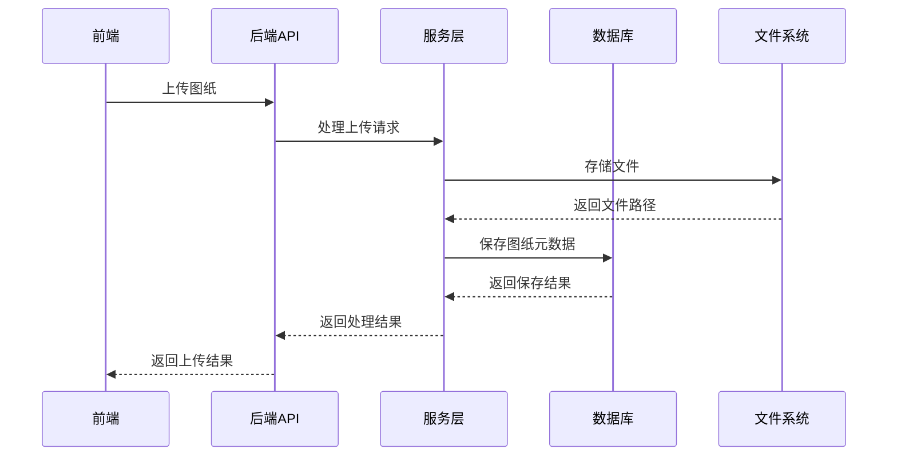

# 图纸管理系统技术架构文档

## 1. 技术选型

### 1.1 前端技术
- **HTML5**：页面结构
- **CSS3**：页面样式
- **JavaScript**：交互逻辑
- **Tailwind CSS**：实用优先的CSS框架，用于快速构建响应式界面
- **Font Awesome**：图标库，提供丰富的图标资源

### 1.2 后端技术
- **Node.js**：JavaScript运行时环境
- **Express**：轻量级Web应用框架
- **MongoDB**：NoSQL数据库，用于存储图纸元数据和用户信息
- **Mongoose**：MongoDB对象建模工具

### 1.3 文件存储
- **本地文件系统**：存储图纸文件
- **GridFS**：MongoDB的文件存储机制，用于存储大文件

### 1.4 其他技术
- **JWT**：JSON Web Token，用于用户认证
- **Multer**：Node.js中间件，用于处理文件上传
- **Winston**：日志管理库

## 2. 架构设计

### 2.1 架构风格
- **分层架构**：前端层、API层、服务层、数据层
- **RESTful API**：前后端分离，通过API进行通信

### 2.2 核心流程图



### 2.3 模块划分

| 模块名称 | 职责 | 技术实现 |
|---------|------|--------|
| 前端展示模块 | 页面渲染、用户交互 | HTML5, CSS3, JavaScript, Tailwind CSS |
| API模块 | 处理HTTP请求，路由管理 | Express |
| 服务模块 | 业务逻辑处理 | Node.js |
| 数据模块 | 数据存储和查询 | MongoDB, Mongoose |
| 文件模块 | 文件存储和管理 | 本地文件系统, GridFS |
| 认证模块 | 用户认证和授权 | JWT |
| 日志模块 | 操作日志记录 | Winston |

## 3. 目录结构

### 3.1 前端目录结构

```
frontend/
├── public/
│   ├── css/
│   ├── js/
│   ├── fonts/
│   └── images/
├── src/
│   ├── components/
│   │   ├── folder-tree/
│   │   ├── drawing-list/
│   │   ├── modal/
│   │   └── common/
│   ├── pages/
│   │   ├── home/
│   │   ├── drawing-management/
│   │   ├── file-management/
│   │   ├── log-management/
│   │   ├── system-settings/
│   │   ├── role-management/
│   │   └── user-management/
│   ├── services/
│   │   ├── api.js
│   │   └── utils.js
│   ├── store/
│   │   └── index.js
│   ├── routes/
│   │   └── index.js
│   ├── App.js
│   └── main.js
├── index.html
└── package.json
```

### 3.2 后端目录结构

```
backend/
├── app/
│   ├── controllers/
│   │   ├── drawingController.js
│   │   ├── folderController.js
│   │   ├── userController.js
│   │   ├── authController.js
│   │   ├── logController.js
│   │   ├── roleController.js
│   │   └── systemController.js
│   ├── middlewares/
│   │   ├── auth.js
│   │   ├── logger.js
│   │   └── errorHandler.js
│   ├── models/
│   │   ├── Drawing.js
│   │   ├── Folder.js
│   │   ├── User.js
│   │   ├── Role.js
│   │   └── Log.js
│   ├── routes/
│   │   ├── drawingRoutes.js
│   │   ├── folderRoutes.js
│   │   ├── userRoutes.js
│   │   ├── authRoutes.js
│   │   ├── logRoutes.js
│   │   ├── roleRoutes.js
│   │   └── systemRoutes.js
│   ├── services/
│   │   ├── drawingService.js
│   │   ├── folderService.js
│   │   ├── userService.js
│   │   ├── authService.js
│   │   ├── logService.js
│   │   ├── roleService.js
│   │   └── systemService.js
│   └── utils/
│       ├── fileUtil.js
│       ├── validationUtil.js
│       └── responseUtil.js
├── config/
│   ├── database.js
│   ├── server.js
│   └── security.js
├── storage/
│   └── drawings/
├── app.js
├── package.json
└── server.js
```

## 4. 关键类与函数

### 4.1 前端关键函数

#### 4.1.1 文件夹树管理
```javascript
// 文件夹树展开/折叠
function toggleFolder(folderId) {
    const folder = document.getElementById(`folder-${folderId}`);
    const icon = folder.querySelector('.folder-icon');
    const children = folder.querySelector('.folder-children');
    
    if (children.classList.contains('hidden')) {
        children.classList.remove('hidden');
        icon.classList.remove('fa-angle-right');
        icon.classList.add('fa-angle-down');
    } else {
        children.classList.add('hidden');
        icon.classList.remove('fa-angle-down');
        icon.classList.add('fa-angle-right');
    }
}
```

#### 4.1.2 批量操作处理
```javascript
// 批量操作处理
function handleBatchOperation(operationType) {
    const selectedCheckboxes = document.querySelectorAll('.drawing-checkbox:checked');
    const selectedIds = Array.from(selectedCheckboxes).map(cb => cb.dataset.id);
    
    if (selectedIds.length === 0) {
        alert('请选择至少一个图纸');
        return;
    }
    
    switch (operationType) {
        case 'copy':
            openCopyModal(selectedIds);
            break;
        case 'move':
            openMoveModal(selectedIds);
            break;
        case 'download':
            batchDownload(selectedIds);
            break;
        case 'delete':
            batchDelete(selectedIds);
            break;
        default:
            break;
    }
}
```

#### 4.1.3 表单验证
```javascript
// 表单验证
function validateForm(formData) {
    const errors = [];
    
    if (!formData.drawingNumber) {
        errors.push('请输入图纸编号');
    }
    
    if (!formData.version) {
        errors.push('请输入版本号');
    }
    
    if (!formData.folderId) {
        errors.push('请选择所属文件夹');
    }
    
    return {
        isValid: errors.length === 0,
        errors
    };
}
```

### 4.2 后端关键函数

#### 4.2.1 图纸上传处理
```javascript
// 图纸上传处理
async function uploadDrawing(req, res) {
    try {
        // 处理文件上传
        const file = req.file;
        
        // 验证文件类型
        if (!isValidFileType(file.mimetype)) {
            return res.status(400).json({ error: '不支持的文件类型' });
        }
        
        // 保存图纸元数据
        const drawing = new Drawing({
            drawingNumber: req.body.drawingNumber,
            version: req.body.version,
            description: req.body.description,
            folderId: req.body.folderId,
            uploadTime: new Date(),
            uploader: req.user._id,
            status: '待审核',
            files: [{
                filename: file.filename,
                path: file.path,
                mimetype: file.mimetype
            }]
        });
        
        await drawing.save();
        
        // 记录操作日志
        await logService.createLog({
            operator: req.user._id,
            operationType: '上传',
            operationObject: drawing._id,
            operationDetail: `上传图纸 ${drawing.drawingNumber}`
        });
        
        res.status(201).json({ success: true, drawing });
    } catch (error) {
        console.error('上传图纸失败:', error);
        res.status(500).json({ error: '上传图纸失败' });
    }
}
```

#### 4.2.2 图纸审批处理
```javascript
// 图纸审批处理
async function approveDrawing(req, res) {
    try {
        const { drawingId, result, comment, attachments } = req.body;
        
        // 查找图纸
        const drawing = await Drawing.findById(drawingId);
        if (!drawing) {
            return res.status(404).json({ error: '图纸不存在' });
        }
        
        // 更新审批状态
        drawing.status = result === 'approved' ? '审核通过' : '审核退回';
        
        // 添加审批记录
        drawing.approvalRecords.push({
            operator: req.user._id,
            operationTime: new Date(),
            operationType: '审批',
            status: drawing.status,
            comment,
            attachments
        });
        
        await drawing.save();
        
        // 记录操作日志
        await logService.createLog({
            operator: req.user._id,
            operationType: '审批',
            operationObject: drawingId,
            operationDetail: `审批图纸 ${drawing.drawingNumber}，结果：${drawing.status}`
        });
        
        res.status(200).json({ success: true, drawing });
    } catch (error) {
        console.error('审批图纸失败:', error);
        res.status(500).json({ error: '审批图纸失败' });
    }
}
```

#### 4.2.3 图纸复制处理
```javascript
// 图纸复制处理
async function copyDrawing(req, res) {
    try {
        const { drawingId, folderIds } = req.body;
        
        // 查找原图纸
        const originalDrawing = await Drawing.findById(drawingId);
        if (!originalDrawing) {
            return res.status(404).json({ error: '图纸不存在' });
        }
        
        // 复制到每个目标文件夹
        const copiedDrawings = [];
        
        for (const folderId of folderIds) {
            // 创建副本
            const copyDrawing = new Drawing({
                drawingNumber: `${originalDrawing.drawingNumber}-副本`,
                version: originalDrawing.version,
                description: originalDrawing.description,
                folderId,
                uploadTime: new Date(),
                uploader: req.user._id,
                status: '待审核',
                files: originalDrawing.files
            });
            
            await copyDrawing.save();
            copiedDrawings.push(copyDrawing);
            
            // 记录操作日志
            await logService.createLog({
                operator: req.user._id,
                operationType: '复制',
                operationObject: copyDrawing._id,
                operationDetail: `复制图纸 ${originalDrawing.drawingNumber} 到文件夹 ${folderId}`
            });
        }
        
        res.status(200).json({ success: true, drawings: copiedDrawings });
    } catch (error) {
        console.error('复制图纸失败:', error);
        res.status(500).json({ error: '复制图纸失败' });
    }
}
```

## 5. 数据库与数据结构

### 5.1 数据库设计

#### 5.1.1 图纸表 (drawings)
| 字段名 | 数据类型 | 描述 |
|-------|---------|------|
| _id | ObjectId | 图纸ID |
| drawingNumber | String | 图纸编号 |
| version | String | 版本号 |
| description | String | 图纸描述 |
| folderId | ObjectId | 所属文件夹ID |
| uploadTime | Date | 上传时间 |
| uploader | ObjectId | 上传人员ID |
| status | String | 审批状态（待审核、审核通过、审核退回、无需审核） |
| files | Array | 附件列表 |
| approvalRecords | Array | 审批记录 |
| createdAt | Date | 创建时间 |
| updatedAt | Date | 更新时间 |

#### 5.1.2 文件夹表 (folders)
| 字段名 | 数据类型 | 描述 |
|-------|---------|------|
| _id | ObjectId | 文件夹ID |
| name | String | 文件夹名称 |
| parentId | ObjectId | 父文件夹ID |
| isBottom | Boolean | 是否底层文件夹 |
| needApproval | Boolean | 是否需要审批 |
| createTime | Date | 创建时间 |
| creator | ObjectId | 创建人员ID |
| createdAt | Date | 创建时间 |
| updatedAt | Date | 更新时间 |

#### 5.1.3 用户表 (users)
| 字段名 | 数据类型 | 描述 |
|-------|---------|------|
| _id | ObjectId | 用户ID |
| username | String | 用户名 |
| password | String | 密码（加密存储） |
| name | String | 姓名 |
| role | ObjectId | 角色ID |
| email | String | 邮箱 |
| phone | String | 电话 |
| createdAt | Date | 创建时间 |
| updatedAt | Date | 更新时间 |

#### 5.1.4 角色表 (roles)
| 字段名 | 数据类型 | 描述 |
|-------|---------|------|
| _id | ObjectId | 角色ID |
| name | String | 角色名称 |
| permissions | Array | 权限列表 |
| createdAt | Date | 创建时间 |
| updatedAt | Date | 更新时间 |

#### 5.1.5 日志表 (logs)
| 字段名 | 数据类型 | 描述 |
|-------|---------|------|
| _id | ObjectId | 日志ID |
| operator | ObjectId | 操作人ID |
| operationTime | Date | 操作时间 |
| operationType | String | 操作类型 |
| operationObject | ObjectId | 操作对象ID |
| operationDetail | String | 操作详情 |
| createdAt | Date | 创建时间 |

### 5.2 数据传输对象 (DTOs)

#### 5.2.1 图纸DTO
```javascript
// 图纸上传DTO
const DrawingUploadDTO = {
    drawingNumber: String,
    version: String,
    description: String,
    folderId: String,
    files: Array
};

// 图纸响应DTO
const DrawingResponseDTO = {
    _id: String,
    drawingNumber: String,
    version: String,
    description: String,
    folderId: String,
    folderName: String,
    uploadTime: Date,
    uploader: String,
    status: String,
    files: Array,
    approvalRecords: Array
};
```

#### 5.2.2 文件夹DTO
```javascript
// 文件夹创建DTO
const FolderCreateDTO = {
    name: String,
    parentId: String,
    isBottom: Boolean,
    needApproval: Boolean
};

// 文件夹响应DTO
const FolderResponseDTO = {
    _id: String,
    name: String,
    parentId: String,
    isBottom: Boolean,
    needApproval: Boolean,
    children: Array
};
```

## 6. API 接口设计

### 6.1 图纸管理接口

| API路径 | 方法 | 功能描述 | 请求体 | 响应体 |
|--------|------|----------|--------|--------|
| /api/drawings | POST | 上传图纸 | drawingNumber, version, description, folderId, file | { success: true, drawing: Object } |
| /api/drawings | GET | 获取图纸列表 | folderId, status, page, limit | { success: true, drawings: Array, total: Number } |
| /api/drawings/:id | GET | 获取图纸详情 | N/A | { success: true, drawing: Object } |
| /api/drawings/:id | PUT | 更新图纸 | drawingNumber, version, description, files | { success: true, drawing: Object } |
| /api/drawings/:id | DELETE | 删除图纸 | N/A | { success: true } |
| /api/drawings/:id/copy | POST | 复制图纸 | folderIds | { success: true, drawings: Array } |
| /api/drawings/:id/move | PUT | 移动图纸 | folderId | { success: true, drawing: Object } |
| /api/drawings/:id/approve | POST | 审批图纸 | result, comment, attachments | { success: true, drawing: Object } |
| /api/drawings/batch | POST | 批量操作 | ids, operation | { success: true } |

### 6.2 文件夹管理接口

| API路径 | 方法 | 功能描述 | 请求体 | 响应体 |
|--------|------|----------|--------|--------|
| /api/folders | POST | 创建文件夹 | name, parentId, isBottom, needApproval | { success: true, folder: Object } |
| /api/folders | GET | 获取文件夹列表 | parentId | { success: true, folders: Array } |
| /api/folders/:id | GET | 获取文件夹详情 | N/A | { success: true, folder: Object } |
| /api/folders/:id | PUT | 更新文件夹 | name, isBottom, needApproval | { success: true, folder: Object } |
| /api/folders/:id | DELETE | 删除文件夹 | N/A | { success: true } |
| /api/folders/tree | GET | 获取文件夹树 | N/A | { success: true, tree: Object } |

### 6.3 用户管理接口

| API路径 | 方法 | 功能描述 | 请求体 | 响应体 |
|--------|------|----------|--------|--------|
| /api/users | POST | 创建用户 | username, password, name, role, email, phone | { success: true, user: Object } |
| /api/users | GET | 获取用户列表 | page, limit | { success: true, users: Array, total: Number } |
| /api/users/:id | GET | 获取用户详情 | N/A | { success: true, user: Object } |
| /api/users/:id | PUT | 更新用户 | name, role, email, phone | { success: true, user: Object } |
| /api/users/:id | DELETE | 删除用户 | N/A | { success: true } |
| /api/users/:id/change-password | PUT | 修改密码 | oldPassword, newPassword | { success: true } |

### 6.4 认证接口

| API路径 | 方法 | 功能描述 | 请求体 | 响应体 |
|--------|------|----------|--------|--------|
| /api/auth/login | POST | 用户登录 | username, password | { success: true, token: String, user: Object } |
| /api/auth/logout | POST | 用户登出 | N/A | { success: true } |
| /api/auth/refresh | POST | 刷新令牌 | token | { success: true, token: String } |

### 6.5 日志管理接口

| API路径 | 方法 | 功能描述 | 请求体 | 响应体 |
|--------|------|----------|--------|--------|
| /api/logs | GET | 获取日志列表 | operator, operationType, startDate, endDate, page, limit | { success: true, logs: Array, total: Number } |
| /api/logs/:id | GET | 获取日志详情 | N/A | { success: true, log: Object } |

### 6.6 角色管理接口

| API路径 | 方法 | 功能描述 | 请求体 | 响应体 |
|--------|------|----------|--------|--------|
| /api/roles | POST | 创建角色 | name, permissions | { success: true, role: Object } |
| /api/roles | GET | 获取角色列表 | N/A | { success: true, roles: Array } |
| /api/roles/:id | GET | 获取角色详情 | N/A | { success: true, role: Object } |
| /api/roles/:id | PUT | 更新角色 | name, permissions | { success: true, role: Object } |
| /api/roles/:id | DELETE | 删除角色 | N/A | { success: true } |

### 6.7 系统管理接口

| API路径 | 方法 | 功能描述 | 请求体 | 响应体 |
|--------|------|----------|--------|--------|
| /api/system/settings | GET | 获取系统设置 | N/A | { success: true, settings: Object } |
| /api/system/settings | PUT | 更新系统设置 | settings | { success: true, settings: Object } |
| /api/system/stats | GET | 获取系统统计数据 | N/A | { success: true, stats: Object } |

## 7. 部署与集成方案

### 7.1 部署环境
- **操作系统**：Linux (Ubuntu 20.04)
- **Node.js**：v14.0+
- **MongoDB**：v4.4+
- **Nginx**：反向代理

### 7.2 部署步骤
1. **服务器准备**：安装Node.js、MongoDB、Nginx
2. **代码部署**：克隆代码仓库，安装依赖
3. **配置文件**：修改配置文件，设置环境变量
4. **启动服务**：使用PM2管理Node.js进程
5. **Nginx配置**：配置反向代理，处理静态文件
6. **防火墙设置**：开放必要的端口

### 7.3 集成方案
- **与企业认证系统集成**：支持LDAP认证
- **与邮件系统集成**：审批通知通过邮件发送
- **与其他系统集成**：提供API接口，支持数据同步

## 8. 监控与维护

### 8.1 监控方案
- **应用监控**：使用PM2监控Node.js进程
- **数据库监控**：使用MongoDB监控工具
- **系统监控**：使用Prometheus和Grafana

### 8.2 日志管理
- **应用日志**：使用Winston记录应用日志
- **访问日志**：Nginx访问日志
- **错误日志**：集中存储错误日志，便于分析

### 8.3 备份策略
- **数据库备份**：定期备份MongoDB数据
- **文件备份**：定期备份图纸文件
- **配置备份**：备份系统配置文件

### 8.4 常见问题与解决方案

| 问题 | 原因 | 解决方案 |
|------|------|----------|
| 文件上传失败 | 文件过大 | 调整Multer配置，增加文件大小限制 |
| 图纸审批流程卡住 | 审批人员未及时处理 | 增加审批超时提醒 |
| 系统响应缓慢 | 数据库查询慢 | 优化数据库查询，添加索引 |
| 图纸文件丢失 | 存储故障 | 实施文件备份策略 |

## 9. 总结

图纸管理系统的技术架构设计采用了现代化的前后端分离架构，使用Node.js、Express、MongoDB等技术栈，实现了图纸的上传、下载、审批、复制、移动等核心功能。系统采用分层架构，模块化设计，具有良好的可扩展性和可维护性。

通过本技术架构的实施，系统能够满足企业对图纸管理的各种需求，提供高效、安全、可靠的图纸管理解决方案。同时，系统的设计也考虑了未来的功能扩展和技术升级，为企业的数字化转型提供了有力的支持。