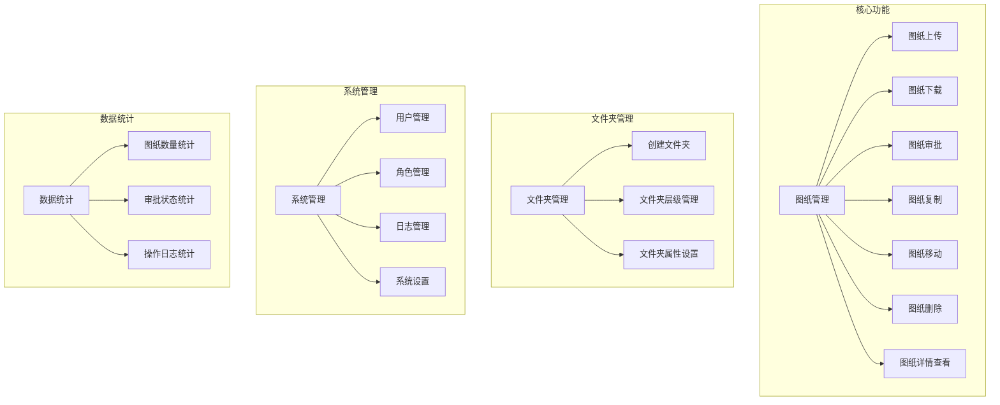
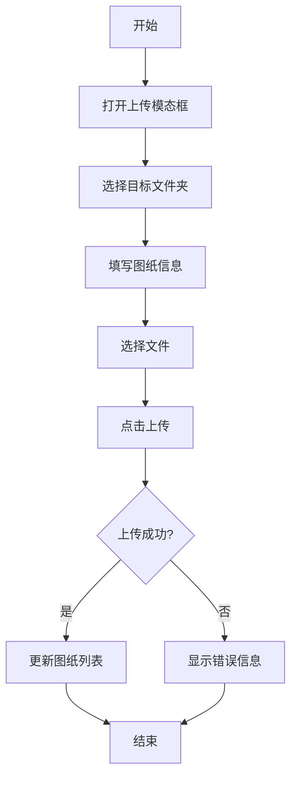
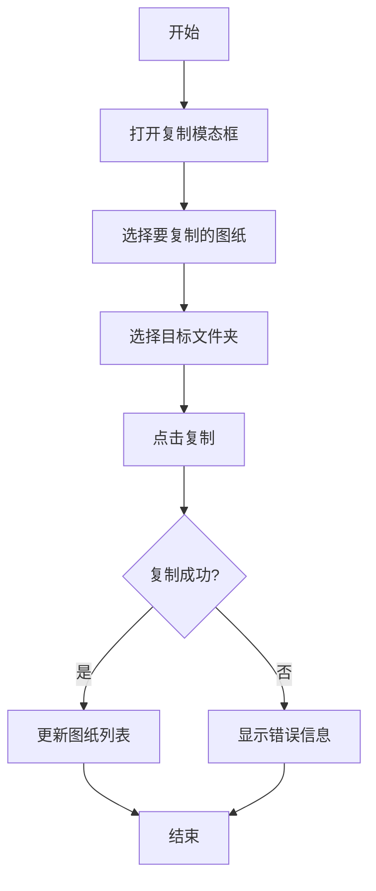
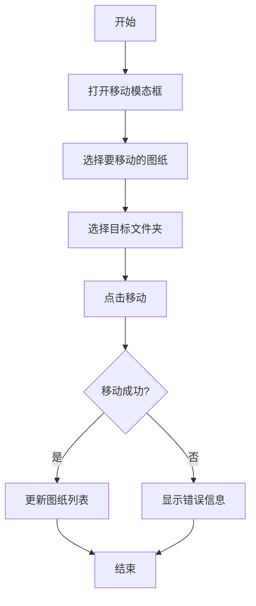

# 图纸管理系统产品需求文档

## 1. 产品概述

图纸管理系统是一个专为企业设计的数字化图纸管理平台，旨在解决传统图纸管理中存在的版本混乱、审批流程不规范、查找困难等问题。系统提供图纸的上传、下载、审批、复制、移动等核心功能，并支持文件夹层级管理、批量操作和完整的审批流程，帮助企业实现图纸的规范化管理和高效协作。

### 1.1 核心目标
- 实现图纸的数字化存储和管理，提高图纸管理效率
- 建立规范的图纸审批流程，确保图纸质量
- 支持图纸的批量操作，减少重复工作
- 提供直观的文件夹层级管理，方便图纸分类和查找
- 实现图纸操作的完整日志记录，确保可追溯性

### 1.2 目标用户
- **设计工程师**：上传、修改、查看图纸
- **审批人员**：审批图纸，提出修改意见
- **管理人员**：管理文件夹结构，查看系统统计数据
- **普通用户**：查看已审批通过的图纸

## 2. 核心功能

### 2.1 功能模块图



### 2.2 功能优先级

| 功能模块 | 优先级 | 功能描述 |
|---------|--------|--------|
| 图纸上传 | P0 | 支持单个和批量上传图纸，支持拖拽上传，支持PDF、DWG等格式 |
| 图纸下载 | P0 | 支持单个和批量下载图纸 |
| 图纸审批 | P0 | 支持图纸的审批流程，包括通过、退回操作，支持上传审批意见和附件 |
| 图纸复制 | P1 | 支持复制图纸创建副本，副本状态为待审核 |
| 图纸移动 | P1 | 支持移动图纸到其他文件夹，保持原状态不变 |
| 文件夹管理 | P0 | 支持创建、编辑文件夹，设置文件夹属性，包括是否需要审批 |
| 批量操作 | P1 | 支持批量复制、移动、下载、删除图纸 |
| 日志管理 | P1 | 记录图纸的所有操作日志，包括上传、修改、审批、复制、移动等 |
| 数据统计 | P2 | 提供图纸数量、审批状态等统计数据 |

## 3. 用户故事

### 3.1 设计工程师
- **故事1**：作为设计工程师，我希望能够上传图纸到系统中，以便进行统一管理和后续审批
- **故事2**：作为设计工程师，我希望能够修改已上传的图纸，以便在审批退回后进行修改并重新提交
- **故事3**：作为设计工程师，我希望能够查看图纸的审批状态和审批意见，以便了解图纸的审核情况
- **故事4**：作为设计工程师，我希望能够复制已有的图纸创建副本，以便在相似设计时提高工作效率

### 3.2 审批人员
- **故事1**：作为审批人员，我希望能够查看待审批的图纸，以便进行审核
- **故事2**：作为审批人员，我希望能够对图纸进行通过或退回操作，并添加审批意见，以便提供明确的审核结果
- **故事3**：作为审批人员，我希望能够上传附件标记图纸中的问题，以便设计工程师能够明确需要修改的地方
- **故事4**：作为审批人员，我希望能够查看图纸的审批历史，以便了解图纸的修改过程

### 3.3 管理人员
- **故事1**：作为管理人员，我希望能够创建和管理文件夹结构，以便对图纸进行分类管理
- **故事2**：作为管理人员，我希望能够设置文件夹的审批属性，以便控制图纸的审批流程
- **故事3**：作为管理人员，我希望能够查看系统的统计数据，以便了解图纸管理的整体情况
- **故事4**：作为管理人员，我希望能够查看操作日志，以便追踪图纸的操作历史

## 4. 页面详情

### 4.1 页面列表

| 页面名称 | 模块名称 | 功能描述 |
|---------|---------|--------|
| 首页 | 统计卡片 | 展示总图纸数、待审核图纸数、审核通过图纸数、审核退回图纸数等统计数据 |
| 首页 | 最近上传图纸 | 展示最近上传的图纸列表，包含图纸编号、版本号、上传时间、上传人员、审批状态等信息 |
| 首页 | 快速操作 | 提供上传图纸、创建文件夹等快速操作按钮 |
| 图纸管理页 | 文件夹树 | 展示文件夹层级结构，支持展开/折叠、点击切换文件夹 |
| 图纸管理页 | 筛选条件 | 提供所属文件夹、图纸编号、版本号、审批状态等筛选条件 |
| 图纸管理页 | 图纸列表 | 展示图纸列表，包含复选框、所属文件夹、图纸编号、版本号、上传时间、上传人员、审批状态、操作按钮等信息 |
| 图纸管理页 | 操作按钮 | 提供详情、修改、下载、复制、移动、审批、删除等操作按钮 |
| 图纸管理页 | 批量操作 | 支持批量复制、移动、下载、删除图纸 |
| 文件管理页 | 文件夹树 | 展示文件夹层级结构，支持展开/折叠、点击切换文件夹 |
| 文件管理页 | 文件夹设置 | 支持设置文件夹名称、是否底层文件夹、是否需要审批等属性 |
| 文件管理页 | 创建文件夹 | 支持创建新文件夹 |
| 日志管理页 | 筛选条件 | 提供操作人、操作类型、操作时间等筛选条件 |
| 日志管理页 | 日志列表 | 展示操作日志列表，包含操作时间、操作人、操作类型、操作对象、操作详情等信息 |
| 系统设置页 | 系统参数设置 | 支持设置系统相关参数 |
| 角色管理页 | 角色列表 | 展示系统角色列表 |
| 角色管理页 | 角色权限设置 | 支持设置角色权限 |
| 用户管理页 | 用户列表 | 展示系统用户列表 |
| 用户管理页 | 用户编辑 | 支持编辑用户信息和分配角色 |

### 4.2 页面详情

#### 4.2.1 首页

| 模块名称 | 功能描述 | UI元素 |
|---------|---------|--------|
| 统计卡片 | 展示总图纸数、待审核图纸数、审核通过图纸数、审核退回图纸数等统计数据，每个卡片包含标题、数值和问号图标（点击显示注释） | 卡片式布局，包含标题、数值、问号图标 |
| 最近上传图纸 | 展示最近上传的图纸列表，包含所属文件夹、图纸编号、版本号、上传时间、上传人员、审批状态、操作按钮等信息 | 表格布局，支持排序和分页 |
| 快速操作 | 提供上传图纸、创建文件夹等快速操作按钮，点击跳转到对应管理页面 | 按钮式布局 |

#### 4.2.2 图纸管理页

| 模块名称 | 功能描述 | UI元素 |
|---------|---------|--------|
| 文件夹树 | 展示文件夹层级结构，支持展开/折叠、点击切换文件夹，当前选中文件夹高亮显示 | 左侧固定宽度，树状结构，支持图标切换 |
| 筛选条件 | 提供所属文件夹、图纸编号、版本号、审批状态等筛选条件，支持重置和查询操作 | 表单布局，包含下拉框、输入框、按钮 |
| 图纸列表 | 展示图纸列表，包含复选框、所属文件夹、图纸编号、版本号、上传时间、上传人员、审批状态、操作按钮等信息，支持排序和分页 | 表格布局，支持全选和单行选择 |
| 操作按钮 | 提供详情、修改、下载、复制、移动、审批、删除等操作按钮，根据图纸状态显示不同的可用按钮 | 图标按钮，带有悬浮提示 |
| 批量操作 | 支持批量复制、移动、下载、删除图纸，根据选中的图纸数量显示操作选项 | 顶部操作栏，包含批量操作按钮 |

#### 4.2.3 文件管理页

| 模块名称 | 功能描述 | UI元素 |
|---------|---------|--------|
| 文件夹树 | 展示文件夹层级结构，支持展开/折叠、点击切换文件夹，当前选中文件夹高亮显示 | 左侧固定宽度，树状结构，支持图标切换 |
| 文件夹设置 | 支持设置文件夹名称、是否底层文件夹、是否需要审批等属性，支持保存操作 | 表单布局，包含输入框、复选框、按钮 |
| 创建文件夹 | 支持创建新文件夹，输入文件夹名称后保存 | 底部固定按钮，点击弹出创建表单 |

#### 4.2.4 日志管理页

| 模块名称 | 功能描述 | UI元素 |
|---------|---------|--------|
| 筛选条件 | 提供操作人、操作类型、操作时间等筛选条件，支持重置和查询操作 | 表单布局，包含下拉框、日期选择器、按钮 |
| 日志列表 | 展示操作日志列表，包含操作时间、操作人、操作类型、操作对象、操作详情等信息，支持排序和分页 | 表格布局 |

## 5. 功能模块拆解和详细描述

### 5.1 图纸管理模块

#### 5.1.1 图纸上传
- **功能描述**：支持单个和批量上传图纸，支持拖拽上传，支持PDF、DWG、DXF等格式
- **输入**：文件夹选择、图纸编号、版本号、图纸描述、文件选择
- **输出**：上传成功提示，图纸列表更新
- **流程**：选择文件夹 → 填写图纸信息 → 选择文件 → 点击上传 → 上传成功

#### 5.1.2 图纸下载
- **功能描述**：支持单个和批量下载图纸
- **输入**：选择图纸
- **输出**：图纸文件下载
- **流程**：选择图纸 → 点击下载按钮 → 开始下载

#### 5.1.3 图纸审批
- **功能描述**：支持对图纸进行审批，包括通过和退回操作，支持添加审批意见和上传附件
- **输入**：审批结果（通过/退回）、审批意见、附件上传
- **输出**：审批状态更新，审批记录添加
- **流程**：打开审批模态框 → 选择审批结果 → 填写审批意见 → 上传附件（可选） → 点击提交 → 审批完成

#### 5.1.4 图纸复制
- **功能描述**：支持复制图纸创建副本，副本状态为待审核
- **输入**：选择要复制的图纸，选择目标文件夹
- **输出**：复制成功提示，副本添加到目标文件夹
- **流程**：选择图纸 → 点击复制按钮 → 选择目标文件夹 → 点击复制 → 复制成功

#### 5.1.5 图纸移动
- **功能描述**：支持移动图纸到其他文件夹，保持原状态不变
- **输入**：选择要移动的图纸，选择目标文件夹
- **输出**：移动成功提示，图纸从原文件夹移除并添加到目标文件夹
- **流程**：选择图纸 → 点击移动按钮 → 选择目标文件夹 → 点击移动 → 移动成功

#### 5.1.6 图纸删除
- **功能描述**：支持删除图纸，删除前需要确认
- **输入**：选择要删除的图纸，确认删除
- **输出**：删除成功提示，图纸从列表中移除
- **流程**：选择图纸 → 点击删除按钮 → 确认删除 → 删除成功

#### 5.1.7 图纸详情查看
- **功能描述**：支持查看图纸的详细信息，包括所属文件夹、图纸编号、版本号、上传时间、上传人员、审批状态、图纸描述、附件、审批记录等
- **输入**：点击详情按钮
- **输出**：图纸详情模态框
- **流程**：点击详情按钮 → 查看图纸详情 → 关闭模态框

### 5.2 文件夹管理模块

#### 5.2.1 创建文件夹
- **功能描述**：支持创建新文件夹，设置文件夹名称和属性
- **输入**：文件夹名称、是否底层文件夹、是否需要审批
- **输出**：文件夹创建成功提示，文件夹树更新
- **流程**：点击创建文件夹按钮 → 填写文件夹信息 → 点击保存 → 创建成功

#### 5.2.2 文件夹层级管理
- **功能描述**：支持文件夹的层级结构管理，包括展开/折叠、点击切换文件夹
- **输入**：点击文件夹节点
- **输出**：文件夹展开/折叠，内容区域更新
- **流程**：点击文件夹节点 → 展开/折叠文件夹 → 查看文件夹内容

#### 5.2.3 文件夹属性设置
- **功能描述**：支持设置文件夹的属性，包括是否底层文件夹、是否需要审批
- **输入**：修改文件夹属性
- **输出**：属性保存成功提示
- **流程**：选择文件夹 → 修改属性 → 点击保存 → 保存成功

### 5.3 审批流程模块

#### 5.3.1 审批流程定义
- **功能描述**：定义图纸的审批流程，包括审批人员、审批步骤等
- **输入**：审批流程设置
- **输出**：审批流程保存成功

#### 5.3.2 审批任务分配
- **功能描述**：根据审批流程自动分配审批任务
- **输入**：图纸提交审批
- **输出**：审批任务分配给审批人员

#### 5.3.3 审批执行
- **功能描述**：审批人员执行审批任务，包括通过和退回操作
- **输入**：审批结果、审批意见、附件
- **输出**：审批状态更新，审批记录添加

#### 5.3.4 审批通知
- **功能描述**：审批完成后通知相关人员
- **输入**：审批完成
- **输出**：审批通知发送

### 5.4 日志管理模块

#### 5.4.1 操作日志记录
- **功能描述**：记录图纸的所有操作日志，包括上传、修改、审批、复制、移动、删除等
- **输入**：用户操作
- **输出**：操作日志记录

#### 5.4.2 日志查询
- **功能描述**：支持根据操作人、操作类型、操作时间等条件查询操作日志
- **输入**：查询条件
- **输出**：符合条件的日志列表

### 5.5 统计分析模块

#### 5.5.1 图纸统计
- **功能描述**：统计图纸的数量、审批状态分布等
- **输入**：系统数据
- **输出**：统计结果展示

#### 5.5.2 操作统计
- **功能描述**：统计用户的操作次数、操作类型分布等
- **输入**：操作日志
- **输出**：统计结果展示

## 6. 核心流程

### 6.1 图纸上传流程



### 6.2 图纸审批流程

```mermaid
flowchart TD
    A[开始] --> B[打开审批模态框]
    B --> C[查看图纸信息]
    C --> D[选择审批结果]
    D --> E[填写审批意见]
    E --> F[上传附件(可选)]
    F --> G[点击提交]
    G --> H{审批结果?}
    H -->|通过| I[更新状态为审核通过]
    H -->|退回| J[更新状态为审核退回]
    I --> K[添加审批记录]
    J --> K
    K --> L[结束]
```

### 6.3 图纸复制流程



### 6.4 图纸移动流程



## 7. UI设计

### 7.1 设计风格
- **主色调**：蓝色 (#1890ff)，代表专业、可信
- **辅助色**：绿色 (#52c41a) 表示成功，黄色 (#faad14) 表示警告，红色 (#f5222d) 表示错误
- **中性色**：白色 (#ffffff) 作为背景，浅灰色 (#f0f2f5) 作为分隔，深灰色 (#262626) 作为文字
- **字体**：Microsoft YaHei, Arial, sans-serif
- **按钮风格**：圆角矩形，带有悬浮效果
- **卡片风格**：白色背景，轻微阴影，圆角边框

### 7.2 页面布局
- **整体布局**：左侧固定宽度的文件夹树，右侧为内容区域
- **内容区域**：顶部为操作栏，中间为筛选条件，下方为数据列表
- **模态框**：居中显示，带有半透明背景遮罩
- **响应式设计**：支持不同屏幕尺寸的适配

### 7.3 交互设计
- **按钮交互**：点击时有反馈效果，悬浮时有提示信息
- **表格交互**：支持排序、分页、全选、单行选择
- **文件夹树交互**：支持展开/折叠，点击切换文件夹
- **表单交互**：实时验证，错误提示
- **批量操作**：选择多个项目后显示批量操作选项

### 7.4 图标设计
- 使用 Font Awesome 图标库
- 图标风格统一，清晰易识别
- 操作按钮使用图标+文字的组合，提高可识别性

## 8. 技术实现

### 8.1 技术栈
- **前端**：HTML5, CSS3, JavaScript, Tailwind CSS
- **后端**：Node.js, Express
- **数据库**：MongoDB
- **文件存储**：本地文件系统或云存储

### 8.2 关键技术点
- **文件上传**：支持拖拽上传，批量上传
- **文件夹树**：递归渲染，支持展开/折叠
- **审批流程**：状态管理，审批记录
- **批量操作**：选择逻辑，操作执行
- **日志记录**：中间件实现，操作追踪

### 8.3 性能优化
- **前端优化**：使用 Tailwind CSS 减少 CSS 文件大小，使用事件委托减少事件监听器
- **后端优化**：使用缓存减少数据库查询，使用流处理大文件上传
- **存储优化**：使用文件压缩，定期清理过期文件

## 9. 数据需求

### 9.1 数据模型

#### 9.1.1 图纸模型
- **_id**：图纸ID
- **drawingNumber**：图纸编号
- **version**：版本号
- **description**：图纸描述
- **folderId**：所属文件夹ID
- **uploadTime**：上传时间
- **uploader**：上传人员
- **status**：审批状态（待审核、审核通过、审核退回、无需审核）
- **files**：附件列表
- **approvalRecords**：审批记录

#### 9.1.2 文件夹模型
- **_id**：文件夹ID
- **name**：文件夹名称
- **parentId**：父文件夹ID
- **isBottom**：是否底层文件夹
- **needApproval**：是否需要审批
- **createTime**：创建时间
- **creator**：创建人员

#### 9.1.3 审批记录模型
- **_id**：记录ID
- **drawingId**：图纸ID
- **operator**：操作人
- **operationTime**：操作时间
- **operationType**：操作类型（上传、修改、审批、复制、移动、删除）
- **status**：审批状态（待审核、审核通过、审核退回）
- **comment**：审批意见
- **attachments**：附件列表

#### 9.1.4 操作日志模型
- **_id**：日志ID
- **operator**：操作人
- **operationTime**：操作时间
- **operationType**：操作类型
- **operationObject**：操作对象
- **operationDetail**：操作详情

### 9.2 数据安全
- **文件加密**：敏感图纸文件加密存储
- **访问控制**：基于角色的访问控制
- **备份策略**：定期备份数据，防止数据丢失
- **审计日志**：记录所有敏感操作，确保可追溯性

## 10. 项目管理

### 10.1 项目阶段
- **需求分析**：收集和分析用户需求
- **设计阶段**：系统设计，包括架构设计、UI设计
- **开发阶段**：前端开发、后端开发、数据库设计
- **测试阶段**：功能测试、性能测试、安全测试
- **部署阶段**：系统部署、数据迁移
- **运维阶段**：系统维护、bug修复、功能迭代

### 10.2 里程碑
- **需求分析完成**：确定系统功能和需求
- **设计完成**：完成系统设计和UI设计
- **开发完成**：完成所有功能模块的开发
- **测试完成**：通过所有测试用例
- **系统上线**：系统正式投入使用

### 10.3 风险评估
- **技术风险**：文件上传性能，大数据量处理
- **业务风险**：用户习惯改变，流程调整
- **安全风险**：数据泄露，未授权访问
- **时间风险**：开发周期延长，测试不充分

## 11. 总结

图纸管理系统是一个功能完善、操作简便的数字化图纸管理平台，通过实现图纸的规范化管理和高效协作，帮助企业提高图纸管理效率，确保图纸质量，减少重复工作。系统的核心功能包括图纸的上传、下载、审批、复制、移动等，支持文件夹层级管理、批量操作和完整的审批流程，满足企业对图纸管理的各种需求。

通过本系统的实施，企业可以实现图纸的数字化转型，提高设计效率和协作能力，为企业的发展提供有力的支持。