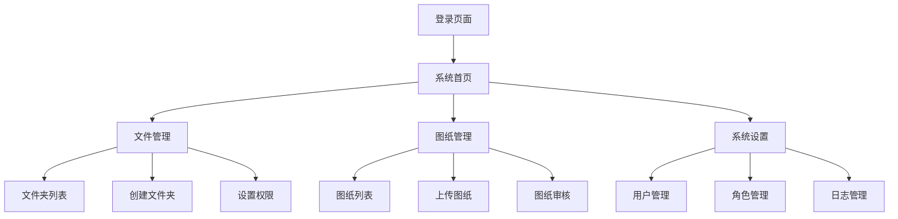
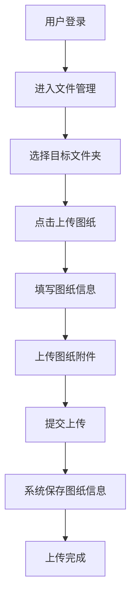
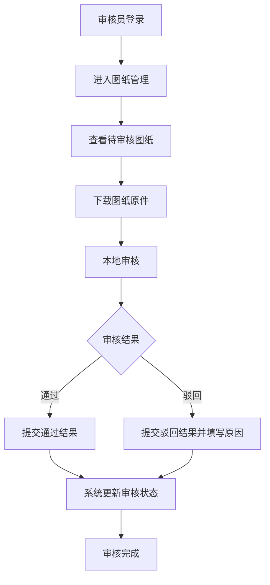

# 企业图纸管理系统产品需求文档

## 1. 产品概述

### 1.1 产品背景
在冶金机械行业中，图纸管理是工程设计和生产制造的核心环节。菏泽双龙冶金机械作为行业内的重要企业，面临着以下挑战：
- 图纸种类繁多，包括冶炼设备、轧制设备、焦化设备、烧结设备等多种类型
- 图纸版本迭代频繁，需要严格的版本控制
- 图纸审核流程复杂，涉及多个部门协作
- 传统的图纸管理方式存在版本混乱、权限管理不严格、审核流程不规范等问题
- 跨部门协作时，图纸的安全传输和有效管理成为亟待解决的问题

本系统旨在为菏泽双龙冶金机械构建一个安全、高效、易用的企业内部图纸管理平台，实现图纸的集中存储、分类管理、规范审核和安全共享。

### 1.2 产品目标
本系统旨在实现以下目标：
- 提供统一的图纸管理入口，实现图纸的集中存储和分类管理
- 建立严格的权限管控体系，确保图纸数据的安全性
- 规范图纸审核流程，提高审核效率和质量
- 提升图纸管理的数字化水平，减少人工操作，降低管理成本
- 适配冶金机械行业的特殊需求，支持行业专用的文件夹结构和命名规范

### 1.3 核心价值
- **提升管理效率**：通过统一的平台和规范的流程，减少人工操作，提高图纸管理的效率
- **确保数据安全**：严格的权限管控和水印功能，防止图纸泄露
- **优化审核流程**：规范的审核流程，提高审核质量和透明度
- **降低管理成本**：减少纸质图纸的使用，降低存储和管理成本
- **行业适配性**：针对冶金机械行业的特殊需求，提供定制化的管理方案

## 2. 核心功能

### 2.1 功能模块概览
| 模块名称 | 功能描述 |
|---------|--------|
| 登录模块 | 用户通过系统创建的账号密码登录，管理登录状态 |
| 文件管理模块 | 支持多级文件夹创建，用于图纸归类与权限管控，适配冶金机械行业的文件夹结构 |
| 图纸管理模块 | 支持图纸上传、下载、审核等操作 |
| 安全性模块 | 支持水印功能，保障数据安全 |
| 系统设置模块 | 支持用户管理、角色管理和日志管理 |

### 2.2 页面导航流程图


## 3. 核心流程

### 3.1 图纸上传流程


### 3.2 图纸审核流程


## 4. 用户角色与权限

### 4.1 用户角色
| 角色名称 | 角色描述 |
|---------|--------|
| 管理员 | 系统最高权限，负责系统配置、用户管理、角色管理等 |
| 设计师 | 负责图纸设计和上传，可查看和管理自己上传的图纸 |
| 审核员 | 负责图纸审核，可查看和审核所有图纸 |
| 普通员工 | 仅可查看自己上传的图纸 |

### 4.2 权限矩阵
| 功能模块 | 管理员 | 设计师 | 审核员 | 普通员工 |
|---------|--------|--------|--------|----------|
| 登录系统 | ✓ | ✓ | ✓ | ✓ |
| 创建文件夹 | ✓ | ✓ | ✓ | × |
| 设置文件夹权限 | ✓ | × | × | × |
| 上传图纸 | ✓ | ✓ | ✓ | ✓ |
| 下载图纸 | ✓ | ✓ | ✓ | ✓ |
| 审核图纸 | ✓ | × | ✓ | × |
| 用户管理 | ✓ | × | × | × |
| 角色管理 | ✓ | × | × | × |
| 日志管理 | ✓ | × | × | × |

## 5. 用户接口设计

### 5.1 设计原则
- **用户体验优先**：确保操作直观、布局清晰，符合目标人群的使用习惯
- **视觉一致性**：使用统一的设计语言和视觉元素，保持界面风格的一致性
- **响应式设计**：适配不同屏幕尺寸，确保在各种设备上都能正常使用
- **现代化UI**：采用现代化的UI元素和设计风格，提升产品的视觉体验
- **性能优化**：减少页面加载时间，提高系统响应速度
- **行业适配**：界面设计符合冶金机械行业的专业特性，操作流程符合行业习惯

### 5.2 页面设计概览

#### 5.2.1 登录页面
- **布局**：居中布局，简洁明了
- **元素**：
  - 系统logo
  - 账号输入框
  - 密码输入框
  - 登录按钮
  - 忘记密码链接
- **交互**：
  - 输入框实时验证
  - 登录按钮点击后显示加载状态
  - 登录失败显示错误提示

#### 5.2.2 系统首页
- **布局**：左侧导航栏，右侧主内容区
- **元素**：
  - 顶部导航栏（系统名称、用户信息、退出按钮）
  - 左侧导航菜单（文件管理、图纸管理、系统设置）
  - 右侧主内容区（欢迎信息、最近操作、待办事项）

#### 5.2.3 文件管理页面
- **布局**：左侧文件夹树，右侧文件夹内容
- **元素**：
  - 文件夹树（支持展开/折叠）
  - 文件夹操作按钮（创建、删除、重命名、设置权限）
  - 文件夹列表（名称、创建时间、创建人、权限状态）
  - 上传按钮
  - 文件夹设置区域（所属文件夹选择、文件夹名称输入、底层文件夹设置）

#### 5.2.4 图纸管理页面
- **布局**：顶部筛选条件，中部图纸列表，右侧操作面板
- **元素**：
  - 筛选条件（项目名称、图纸编号、版本号、状态）
  - 图纸列表（项目名称、图纸编号、版本号、提交时间、提交人员、状态）
  - 操作按钮（上传、下载、审核）
  - 审核操作面板（通过/驳回、审核意见）

#### 5.2.5 系统设置页面
- **布局**：左侧子菜单，右侧设置内容
- **元素**：
  - 子菜单（用户管理、角色管理、日志管理）
  - 用户管理（用户列表、添加/编辑/删除用户）
  - 角色管理（角色列表、添加/编辑/删除角色、设置权限）
  - 日志管理（日志列表、筛选条件）

### 5.3 色彩方案
- **主色调**：#1890ff（蓝色）- 代表专业、信任和安全
- **辅助色**：#52c41a（绿色）- 用于成功状态和确认操作
- **警告色**：#faad14（黄色）- 用于警告信息和待处理状态
- **错误色**：#f5222d（红色）- 用于错误信息和拒绝操作
- **中性色**：
  - #f0f2f5（浅灰色）- 用于背景
  - #e8e8e8（中灰色）- 用于边框和分割线
  - #8c8c8c（深灰色）- 用于次要文本
  - #262626（黑色）- 用于主要文本

### 5.4 字体方案
- **主要字体**：Microsoft YaHei, Arial, sans-serif
- **标题字体大小**：16px-20px
- **正文字体大小**：14px
- **次要文本字体大小**：12px
- **字体粗细**：
  - 标题：600
  - 正文：400
  - 强调文本：500

### 5.5 交互设计
- **按钮交互**：
  - 鼠标悬停时显示轻微阴影和颜色变化
  - 点击时显示按压效果
  - 禁用状态显示灰色，无交互效果
- **表单交互**：
  - 输入框获得焦点时显示蓝色边框
  - 输入错误时显示红色边框和错误提示
  - 输入正确时显示绿色边框
- **列表交互**：
  - 鼠标悬停时显示背景色变化
  - 点击时显示选中状态
  - 支持多选操作
- **加载状态**：
  - 使用骨架屏或加载动画显示加载状态
  - 操作完成后显示成功/失败提示

## 6. 功能模块拆解与详细需求

### 6.1 登录模块

#### 6.1.1 功能说明
用户通过系统创建的账号密码登录，系统验证用户身份并管理登录状态。

#### 6.1.2 详细需求
| 功能点 | 用户故事 | 输入/输出/流程 | 详细说明 |
|-------|---------|---------------|--------|
| 账号密码登录 | 作为系统用户，我希望通过账号密码登录系统，以便访问系统功能 | 输入：账号、密码<br>输出：登录成功/失败提示<br>流程：输入账号密码 → 点击登录 → 系统验证 → 登录成功进入首页/登录失败显示错误提示 | 1. 账号为系统创建的用户名<br>2. 密码为系统创建的密码<br>3. 支持密码显示/隐藏切换<br>4. 登录失败显示具体错误信息<br>5. 连续登录失败次数限制（如5次后锁定账号） |
| 登录状态管理 | 作为系统用户，我希望系统保持我的登录状态，以便下次访问时无需重复登录 | 输入：无<br>输出：保持登录状态<br>流程：登录成功 → 系统存储登录状态 → 下次访问自动登录 | 1. 使用cookie或localStorage存储登录状态<br>2. 登录状态有效期设置（如7天）<br>3. 退出登录后清除登录状态 |
| 忘记密码 | 作为系统用户，我希望在忘记密码时能够重置密码，以便重新登录系统 | 输入：账号<br>输出：密码重置链接/验证码<br>流程：点击忘记密码 → 输入账号 → 系统验证 → 发送重置链接/验证码 → 重置密码 | 1. 支持通过邮箱或手机验证码重置密码<br>2. 重置链接有效期设置（如24小时）<br>3. 验证码有效期设置（如10分钟） |

### 6.2 文件管理模块

#### 6.2.1 功能说明
支持多级文件夹创建，用于图纸归类与权限管控，适配冶金机械行业的特殊需求。

#### 6.2.2 详细需求
| 功能点 | 用户故事 | 输入/输出/流程 | 详细说明 |
|-------|---------|---------------|--------|
| 创建多级文件夹 | 作为设计师，我希望能够创建多级文件夹，以便对图纸进行分类管理 | 输入：文件夹名称、父文件夹路径<br>输出：文件夹创建成功/失败提示<br>流程：点击创建文件夹 → 输入文件夹名称 → 选择父文件夹 → 点击确认 → 系统创建文件夹 | 1. 支持无限级文件夹创建<br>2. 文件夹名称不能为空且不能重复<br>3. 支持文件夹重命名和删除<br>4. 删除文件夹时提示确认，且删除后不可恢复<br>5. 默认文件夹结构适配冶金机械行业：冶炼设备、轧制设备、焦化设备、烧结设备、辅助设备等 |
| 底层文件夹设置 | 作为系统用户，我希望能够设置底层文件夹，以便控制文件夹的功能权限 | 输入：底层文件夹标记<br>输出：文件夹属性更新<br>流程：创建/编辑文件夹 → 勾选底层文件夹选项 → 系统更新文件夹属性 | 1. 底层文件夹：可上传图纸，但不能创建子文件夹<br>2. 非底层文件夹：可创建子文件夹，也可上传图纸<br>3. 文件夹属性在创建时设置，可后续修改 |
| 设置文件夹权限 | 作为管理员，我希望能够为不同文件夹设置不同的访问权限，以便确保数据安全 | 输入：文件夹路径、角色、权限<br>输出：权限设置成功/失败提示<br>流程：选择文件夹 → 点击设置权限 → 选择角色 → 设置权限 → 点击确认 → 系统保存权限设置 | 1. 权限类型包括：查看、上传、下载、删除、设置权限<br>2. 支持批量设置权限<br>3. 权限设置实时生效<br>4. 权限变更记录到系统日志 |
| 查看文件夹内容 | 作为系统用户，我希望能够查看文件夹内的图纸和子文件夹，以便快速找到需要的图纸 | 输入：文件夹路径<br>输出：文件夹内容列表<br>流程：点击文件夹 → 系统加载文件夹内容 → 显示图纸和子文件夹列表 | 1. 显示文件夹内的图纸和子文件夹<br>2. 支持按名称、时间等排序<br>3. 支持搜索功能<br>4. 仅显示用户有权限查看的内容 |

### 6.3 图纸管理模块

#### 6.3.1 功能说明
支持图纸上传、下载、审核等操作。

#### 6.3.2 详细需求
| 功能点 | 用户故事 | 输入/输出/流程 | 详细说明 |
|-------|---------|---------------|--------|
| 图纸上传 | 作为设计师，我希望能够上传图纸到指定文件夹，以便分享和管理 | 输入：项目名称、图纸编号、版本号、图纸附件<br>输出：上传成功/失败提示<br>流程：选择文件夹 → 点击上传图纸 → 填写图纸信息 → 选择图纸附件 → 点击提交 → 系统上传图纸 | 1. 支持DWG/三维图等格式的图纸上传<br>2. 上传字段包括：项目名称、图纸编号、版本号、提交时间、提交人员、图纸附件<br>3. 提交时间和提交人员自动填充<br>4. 上传进度显示<br>5. 上传失败显示错误信息<br>6. 图纸编号和版本号格式符合冶金机械行业规范 |
| 图纸下载 | 作为系统用户，我希望能够下载图纸附件，以便本地查看和使用 | 输入：图纸ID<br>输出：图纸附件<br>流程：选择图纸 → 点击下载 → 系统生成下载链接 → 下载图纸附件 | 1. 支持单个和批量下载<br>2. 下载时自动添加水印<br>3. 下载记录到系统日志<br>4. 仅允许下载用户有权限的图纸 |
| 图纸审核 | 作为审核员，我希望能够审核图纸，以便确保图纸质量 | 输入：图纸ID、审核结果、审核意见<br>输出：审核结果提示<br>流程：查看待审核图纸 → 下载图纸原件 → 本地审核 → 提交审核结果 → 系统更新审核状态 | 1. 审核状态包括：待审核、审核通过、审核驳回<br>2. 审核驳回需填写驳回原因<br>3. 审核结果通知相关人员<br>4. 审核记录到系统日志 |

### 6.4 安全性模块

#### 6.4.1 功能说明
支持水印功能，保障数据安全。

#### 6.4.2 详细需求
| 功能点 | 用户故事 | 输入/输出/流程 | 详细说明 |
|-------|---------|---------------|--------|
| 水印功能 | 作为系统管理员，我希望图纸下载后自动添加水印，以防止图纸泄露 | 输入：无<br>输出：带水印的图纸<br>流程：用户下载图纸 → 系统自动添加水印 → 用户获取带水印的图纸 | 1. 水印内容包括：下载用户、下载时间、系统名称<br>2. 水印位置：对角线覆盖整个图纸<br>3. 水印透明度：不影响图纸内容查看<br>4. 支持水印模板自定义 |

### 6.5 系统设置模块

#### 6.5.1 功能说明
支持用户管理、角色管理和日志管理。

#### 6.5.2 详细需求
| 功能点 | 用户故事 | 输入/输出/流程 | 详细说明 |
|-------|---------|---------------|--------|
| 用户管理 | 作为系统管理员，我希望能够管理系统用户，以便控制用户访问权限 | 输入：用户账号、姓名、所属部门、角色<br>输出：用户创建/编辑/删除成功/失败提示<br>流程：进入用户管理 → 点击添加/编辑/删除用户 → 填写用户信息 → 点击确认 → 系统保存用户信息 | 1. 支持添加、编辑、删除用户<br>2. 用户字段包括：用户账号、姓名、所属部门、角色、状态<br>3. 支持用户状态启用/禁用<br>4. 支持批量操作 |
| 角色管理 | 作为系统管理员，我希望能够管理系统角色，以便灵活分配权限 | 输入：角色名称、权限设置<br>输出：角色创建/编辑/删除成功/失败提示<br>流程：进入角色管理 → 点击添加/编辑/删除角色 → 填写角色信息 → 设置权限 → 点击确认 → 系统保存角色信息 | 1. 支持添加、编辑、删除角色<br>2. 默认角色包括：管理员、设计师、审核员、普通员工<br>3. 支持自定义角色<br>4. 权限设置按文件夹分配<br>5. 支持权限批量设置 |
| 日志管理 | 作为系统管理员，我希望能够查看系统日志，以便监督和审计系统操作 | 输入：筛选条件（时间范围、操作类型、操作人）<br>输出：日志列表<br>流程：进入日志管理 → 设置筛选条件 → 点击查询 → 系统显示日志列表 | 1. 日志记录内容包括：访问时间、访问人员、操作类型、访问的图纸/文件夹、操作结果<br>2. 支持按时间范围、操作类型、操作人筛选<br>3. 支持日志导出（如Excel格式）<br>4. 日志保存期限设置（如1年） |

## 7. 技术实现方案

### 7.1 系统架构
- **前端**：HTML5 + Tailwind CSS + JavaScript
- **后端**：Spring Boot + MyBatis
- **数据库**：MySQL
- **文件存储**：本地文件系统 + 云存储
- **认证授权**：JWT
- **安全加密**：HTTPS + AES-256

### 7.2 部署方案
- **服务器部署**：部署完整系统，包括前端、后端、数据库和文件存储
- **网络配置**：确保网络带宽满足文件传输需求
- **备份策略**：定期对图纸数据进行备份，防止数据丢失

### 7.3 集成方案
- **与现有系统集成**：支持与企业现有ERP、OA等系统集成
- **API接口**：提供RESTful API接口，支持第三方系统调用
- **单点登录**：支持与企业现有认证系统集成，实现单点登录

## 8. 安全性考虑

### 8.1 数据安全
- **权限管控**：严格的基于角色和文件夹的权限管控体系
- **数据加密**：传输过程使用HTTPS加密，存储过程使用AES-256加密
- **水印功能**：图纸下载后自动添加水印，防止图纸泄露
- **备份策略**：定期对图纸数据进行备份，防止数据丢失

### 8.2 网络安全
- **防火墙**：配置防火墙，限制外部访问
- **入侵检测**：部署入侵检测系统，监控异常访问

### 8.3 操作安全
- **登录安全**：连续登录失败次数限制，防止暴力破解
- **日志审计**：详细记录系统操作日志，便于审计和追溯
- **权限审批**：重要权限变更需要审批流程
- **定期安全检查**：定期进行安全检查，发现并修复安全漏洞

## 9. 项目管理与交付计划

### 9.1 项目里程碑
| 里程碑 | 时间节点 | 交付物 |
|-------|---------|-------|
| 需求分析与设计 | 第1-2周 | 产品需求文档、UI设计稿 |
| 前端开发 | 第3-6周 | 前端页面、交互功能 |
| 后端开发 | 第3-7周 | 后端API、数据库设计、文件存储 |
| 测试与调试 | 第8-9周 | 功能测试、性能测试、安全测试 |
| 部署与上线 | 第10周 | 系统部署、用户培训、上线运行 |

### 9.2 风险管理
| 风险点 | 风险等级 | 应对措施 |
|-------|---------|--------|
| 需求变更 | 中 | 建立需求变更管理流程，评估变更影响，控制变更范围 |
| 技术难点 | 中 | 提前进行技术调研和原型开发，解决关键技术问题 |
| 数据迁移 | 低 | 制定详细的数据迁移计划，确保数据安全迁移 |
| 网络延迟 | 中 | 优化系统性能，增加缓存机制，确保访问流畅 |
| 安全漏洞 | 高 | 定期进行安全测试，及时修复安全漏洞，加强安全防护 |

### 9.3 交付标准
- **功能完整性**：所有功能模块按照需求文档实现
- **性能指标**：系统响应时间<2秒，文件上传/下载速度满足业务需求
- **安全合规**：通过安全测试，符合企业安全标准
- **用户体验**：界面美观、操作便捷，符合用户使用习惯
- **文档完整**：提供完整的系统文档，包括用户手册、管理员手册、技术文档

## 10. 总结

本产品需求文档详细描述了企业图纸管理系统的功能需求、设计规范和实现方案。系统旨在解决菏泽双龙冶金机械在图纸管理中的痛点问题，提供安全、高效、易用的图纸管理解决方案。通过严格的权限管控、规范的审核流程，系统将帮助企业提升图纸管理的数字化水平，降低管理成本，提高管理效率。

系统的核心价值在于确保图纸数据的安全性和提升管理效率，通过现代化的技术实现和用户友好的界面设计，为企业提供一个专业的图纸管理平台。

本需求文档为系统开发提供了明确的指导，后续将根据开发过程中的实际情况进行适当调整和优化，确保系统能够满足企业的实际需求。

## 11. 附录

### 11.1 冶金机械行业文件夹结构
```
根目录/
├── 冶炼设备/
│   ├── 高炉/
│   ├── 转炉/
│   ├── 电炉/
│   └── 精炼炉/
├── 轧制设备/
│   ├── 轧机/
│   ├── 矫直机/
│   └── 卷取机/
├── 焦化设备/
│   ├── 焦炉/
│   ├── 干熄焦/
│   └── 煤气净化/
├── 烧结设备/
│   ├── 烧结机/
│   ├── 球团设备/
│   └── 冷却设备/
└── 辅助设备/
    ├── 环保设备/
    ├── 输送设备/
    └── 电气设备/
```

### 11.2 图纸编号规范
- **冶炼设备**：YL-XXXXX-VX.X
- **轧制设备**：ZZ-XXXXX-VX.X
- **焦化设备**：JH-XXXXX-VX.X
- **烧结设备**：SJ-XXXXX-VX.X
- **辅助设备**：FZ-XXXXX-VX.X

其中：
- YL/ZZ/JH/SJ/FZ：设备类型代码
- XXXXX：图纸序号
- VX.X：版本号

### 11.3 系统术语表
| 术语 | 解释 |
|-----|------|
| 底层文件夹 | 不能创建子文件夹的文件夹，只能上传图纸 |
| 图纸审核 | 对上传的图纸进行质量检查和审批的过程 |
| 水印 | 添加到图纸上的半透明标识，用于防止图纸泄露 |
| JWT | JSON Web Token，用于用户认证的安全标准 |
| AES-256 | 高级加密标准，256位密钥长度的加密算法 |