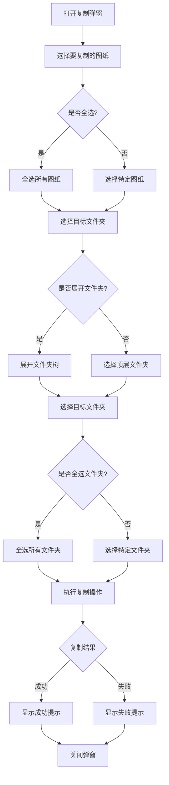

# 批量复制图纸功能产品需求文档

## 1. 产品概览

### 1.1 功能定位
批量复制图纸功能是企业图纸管理系统的一个重要增强功能，旨在提高图纸管理的效率和灵活性。该功能允许用户同时选择多个图纸，并将其复制到一个或多个目标文件夹中，解决了传统单张复制操作繁琐、效率低下的问题。

### 1.2 目标用户
- **设计工程师**：需要在不同项目间共享和复用图纸
- **审核人员**：需要将审核通过的图纸复制到多个相关文件夹
- **企业管理层**：需要快速部署标准图纸到多个项目

### 1.3 核心价值
- **提高效率**：减少重复操作，一次复制多张图纸
- **增强灵活性**：支持选择性复制，只复制需要的图纸
- **优化用户体验**：直观的操作界面，减少操作复杂度
- **提升系统价值**：完善图纸管理的全生命周期功能

## 2. 核心功能

### 2.1 功能模块

| 模块名称 | 功能描述 |
|---------|----------|
| 图纸选择模块 | 支持选择多个图纸，包括全选/取消全选功能 |
| 文件夹选择模块 | 支持以树状结构显示文件夹，支持多选目标文件夹 |
| 复制操作模块 | 执行复制操作，处理复制结果和错误提示 |
| 操作反馈模块 | 提供复制成功/失败的反馈信息 |

### 2.2 功能流程图



## 3. 用户故事与功能需求

### 3.1 用户故事

| 用户故事 | 功能需求 | 验收标准 |
|---------|----------|----------|
| 作为设计工程师，我希望能够一次性选择多个图纸进行复制，以便快速将相关图纸共享到其他项目 | 多图纸选择功能 | 1. 支持通过复选框选择多个图纸<br>2. 支持全选/取消全选操作<br>3. 实时显示已选择的图纸数量 |
| 作为设计工程师，我希望能够看到所有可选的图纸信息，以便做出准确的选择 | 图纸信息展示 | 1. 显示图纸编号、版本号等关键信息<br>2. 清晰标识已选择的图纸<br>3. 支持滚动查看大量图纸 |
| 作为审核人员，我希望能够以树状结构查看和选择目标文件夹，以便快速定位到正确的文件夹 | 树状文件夹结构 | 1. 以树状层级显示文件夹结构<br>2. 支持展开/折叠文件夹<br>3. 清晰标识文件夹层级关系 |
| 作为审核人员，我希望能够同时选择多个目标文件夹，以便将图纸复制到所有相关位置 | 多文件夹选择 | 1. 支持通过复选框选择多个文件夹<br>2. 支持全选/取消全选操作<br>3. 实时显示已选择的文件夹数量 |
| 作为企业管理层，我希望在复制操作完成后获得明确的反馈，以便确认操作结果 | 操作反馈机制 | 1. 显示复制成功/失败的详细信息<br>2. 提供清晰的错误提示（如无权限、文件已存在等）<br>3. 复制成功后自动关闭弹窗或提供关闭选项 |

### 3.2 功能需求

#### 3.2.1 图纸选择功能
- **FR-001**：支持在复制弹窗中显示多个图纸选项
- **FR-002**：每个图纸项前添加复选框，支持多选
- **FR-003**：提供"全选"复选框，支持一键选择所有图纸
- **FR-004**：实时显示已选择的图纸数量
- **FR-005**：支持通过滚动查看大量图纸列表

#### 3.2.2 文件夹选择功能
- **FR-006**：将原有的文件夹下拉选择替换为树状结构
- **FR-007**：支持文件夹的展开/折叠操作
- **FR-008**：每个文件夹前添加复选框，支持多选
- **FR-009**：提供"全选"复选框，支持一键选择所有文件夹
- **FR-010**：实时显示已选择的文件夹数量
- **FR-011**：支持通过滚动查看大量文件夹列表

#### 3.2.3 复制操作功能
- **FR-012**：支持将选中的多个图纸复制到选中的多个文件夹
- **FR-013**：执行复制前验证用户权限
- **FR-014**：处理复制过程中的错误（如文件已存在、无权限等）
- **FR-015**：提供复制结果的详细反馈

#### 3.2.4 界面交互功能
- **FR-016**：复制弹窗大小适应内容，支持响应式布局
- **FR-017**：提供明确的操作按钮（复制、取消）
- **FR-018**：支持键盘快捷键操作（如Enter执行复制，Esc取消）
- **FR-019**：在复制过程中显示加载状态

## 4. 界面设计与交互

### 4.1 设计风格
- **遵循系统整体设计风格**：保持与现有系统一致的蓝色系主色调
- **布局**：模态弹窗形式，居中显示
- **字体**：与系统其他部分保持一致
- **图标**：使用Font Awesome图标库

### 4.2 页面结构

| 区域名称 | 内容组成 |
|---------|----------|
| 弹窗标题 | 标题"复制图纸"，关闭按钮 |
| 图纸选择区域 | 全选复选框，图纸列表（带复选框），已选择数量显示 |
| 文件夹选择区域 | 全选复选框，树状文件夹结构（带复选框），已选择数量显示 |
| 操作按钮区域 | 取消按钮，复制按钮 |
| 操作反馈区域 | 复制结果提示信息 |

### 4.3 界面原型

#### 4.3.1 复制弹窗界面

```html
<!-- 复制弹窗结构 -->
<div id="copy-modal" class="fixed inset-0 bg-black/50 flex items-center justify-center z-50">
    <div class="bg-white rounded-lg shadow-lg w-full max-w-2xl p-6">
        <!-- 弹窗标题 -->
        <div class="flex items-center justify-between mb-4">
            <h3 class="text-lg font-semibold">复制图纸</h3>
            <button id="close-copy-modal" class="text-gray-text hover:text-danger transition-all-300">
                <i class="fa fa-times"></i>
            </button>
        </div>
        
        <!-- 图纸选择区域 -->
        <div class="mb-6">
            <div class="flex items-center justify-between mb-2">
                <p class="text-sm text-gray-text">图纸信息：</p>
                <div class="flex items-center">
                    <input type="checkbox" id="select-all-drawings" class="w-4 h-4 text-primary focus:ring-primary border-gray-border rounded mr-2">
                    <label for="select-all-drawings" class="text-sm text-gray-text">全选</label>
                </div>
            </div>
            <div class="mt-2 p-3 bg-light rounded-md max-h-60 overflow-y-auto" id="copy-drawing-list">
                <!-- 图纸列表项 -->
                <div class="drawing-item flex items-center justify-between py-2 border-b border-gray-border last:border-b-0">
                    <div class="flex items-center">
                        <input type="checkbox" class="drawing-checkbox w-4 h-4 text-primary focus:ring-primary border-gray-border rounded mr-2" checked>
                        <div>
                            <p class="text-sm font-medium">SM-2026-001</p>
                            <p class="text-xs text-gray-text">版本：V1.0</p>
                        </div>
                    </div>
                </div>
                <!-- 更多图纸项 -->
            </div>
            <div class="mt-2 text-sm text-gray-text" id="selected-count">
                已选择 <span id="selected-number">1</span> 个图纸
            </div>
        </div>
        
        <!-- 文件夹选择区域 -->
        <div class="mb-6">
            <div class="flex items-center justify-between mb-2">
                <p class="text-sm text-gray-text">选择要复制到的文件夹：</p>
                <div class="flex items-center">
                    <input type="checkbox" id="select-all-folders" class="w-4 h-4 text-primary focus:ring-primary border-gray-border rounded mr-2">
                    <label for="select-all-folders" class="text-sm text-gray-text">全选</label>
                </div>
            </div>
            <div class="p-3 bg-light rounded-md max-h-60 overflow-y-auto" id="folder-tree">
                <!-- 根目录 -->
                <div class="folder-item mb-2">
                    <div class="folder-header flex items-center py-1">
                        <input type="checkbox" class="folder-checkbox w-4 h-4 text-primary focus:ring-primary border-gray-border rounded mr-2">
                        <i class="fa fa-folder-open text-primary mr-2 folder-icon"></i>
                        <span class="folder-name font-medium">根目录</span>
                        <i class="fa fa-angle-down ml-auto text-gray-text folder-toggle"></i>
                    </div>
                    <!-- 子文件夹 -->
                    <div class="ml-6 pl-2 mt-1">
                        <div class="folder-item">
                            <div class="folder-header flex items-center py-1">
                                <input type="checkbox" class="folder-checkbox w-4 h-4 text-primary focus:ring-primary border-gray-border rounded mr-2">
                                <i class="fa fa-folder text-warning mr-2 folder-icon"></i>
                                <span class="folder-name">固定文件夹</span>
                                <i class="fa fa-angle-right ml-auto text-gray-text folder-toggle"></i>
                            </div>
                        </div>
                        <!-- 更多子文件夹 -->
                    </div>
                </div>
            </div>
            <div class="mt-2 text-sm text-gray-text" id="selected-folders-count">
                已选择 <span id="selected-folders-number">0</span> 个文件夹
            </div>
        </div>
        
        <!-- 操作按钮 -->
        <div class="flex justify-end space-x-2">
            <button id="cancel-copy-btn" class="bg-white border border-gray-border hover:border-primary text-gray-text hover:text-primary px-4 py-2 rounded-md transition-all-300">
                取消
            </button>
            <button id="confirm-copy-btn" class="bg-primary hover:bg-primary/90 text-white px-4 py-2 rounded-md transition-all-300">
                复制
            </button>
        </div>
    </div>
</div>
```

### 4.4 交互流程

1. **打开复制弹窗**：用户在图纸列表中选择一个或多个图纸，点击"复制"按钮
2. **选择图纸**：
   - 系统默认选中用户在列表中选择的图纸
   - 用户可以通过复选框选择或取消选择特定图纸
   - 用户可以点击"全选"按钮选择所有图纸
   - 系统实时显示已选择的图纸数量
3. **选择目标文件夹**：
   - 系统以树状结构显示所有文件夹
   - 用户可以点击文件夹前的展开/折叠图标查看子文件夹
   - 用户可以通过复选框选择一个或多个目标文件夹
   - 用户可以点击"全选"按钮选择所有文件夹
   - 系统实时显示已选择的文件夹数量
4. **执行复制**：
   - 用户点击"复制"按钮执行操作
   - 系统验证至少选择了一个图纸和一个文件夹
   - 系统执行复制操作
   - 系统显示复制结果反馈
5. **关闭弹窗**：
   - 复制完成后，用户可以点击"确定"按钮关闭弹窗
   - 用户可以随时点击"取消"按钮或关闭图标关闭弹窗

## 5. 功能需求

### 5.1 功能需求列表

| 需求ID | 功能点 | 用户故事 | 输入/输出/流程 | 详细说明 |
|--------|--------|---------|---------------|----------|
| FR-001 | 多图纸选择 | 作为设计工程师，我希望能够一次性选择多个图纸进行复制 | 输入：用户勾选图纸复选框<br>输出：更新选中状态和计数<br>流程：用户勾选 → 系统更新状态 → 显示计数 | 1. 每个图纸项前显示复选框<br>2. 支持多选操作<br>3. 实时更新选中计数 |
| FR-002 | 全选图纸 | 作为设计工程师，我希望能够快速选择所有图纸 | 输入：用户点击全选复选框<br>输出：所有图纸被选中/取消选中<br>流程：点击全选 → 系统更新所有图纸状态 → 显示计数 | 1. 提供全选复选框<br>2. 点击后所有图纸状态同步<br>3. 全选状态与所有图纸状态联动 |
| FR-003 | 树状文件夹结构 | 作为审核人员，我希望能够清晰地查看文件夹层级关系 | 输入：用户点击展开/折叠图标<br>输出：文件夹树展开/折叠<br>流程：点击图标 → 系统切换展开状态 → 更新显示 | 1. 以树状层级显示文件夹<br>2. 支持展开/折叠操作<br>3. 显示清晰的层级缩进 |
| FR-004 | 多文件夹选择 | 作为审核人员，我希望能够同时选择多个目标文件夹 | 输入：用户勾选文件夹复选框<br>输出：更新选中状态和计数<br>流程：用户勾选 → 系统更新状态 → 显示计数 | 1. 每个文件夹前显示复选框<br>2. 支持多选操作<br>3. 实时更新选中计数 |
| FR-005 | 全选文件夹 | 作为审核人员，我希望能够快速选择所有文件夹 | 输入：用户点击全选复选框<br>输出：所有文件夹被选中/取消选中<br>流程：点击全选 → 系统更新所有文件夹状态 → 显示计数 | 1. 提供全选复选框<br>2. 点击后所有文件夹状态同步<br>3. 全选状态与所有文件夹状态联动 |
| FR-006 | 批量复制操作 | 作为企业管理层，我希望能够一次性将多张图纸复制到多个文件夹 | 输入：用户点击复制按钮<br>输出：复制结果反馈<br>流程：点击复制 → 系统执行复制 → 显示结果 | 1. 验证至少选择了一个图纸和一个文件夹<br>2. 执行复制操作<br>3. 处理复制过程中的错误 |
| FR-007 | 操作反馈 | 作为设计工程师，我希望能够清楚地知道复制操作的结果 | 输入：系统执行复制操作<br>输出：成功/失败提示<br>流程：复制完成 → 系统生成反馈 → 显示提示 | 1. 显示复制成功的详细信息（如复制了多少文件）<br>2. 显示复制失败的错误信息<br>3. 提供明确的关闭按钮 |

### 5.2 非功能需求

| 需求ID | 需求点 | 详细说明 |
|--------|--------|----------|
| NFR-001 | 性能要求 | 复制操作响应时间不超过3秒（对于10张以内的图纸） |
| NFR-002 | 可用性要求 | 操作界面直观易懂，新用户无需培训即可使用 |
| NFR-003 | 兼容性要求 | 与现有系统的权限体系完全兼容 |
| NFR-004 | 错误处理 | 提供清晰的错误提示和处理建议 |
| NFR-005 | 安全性要求 | 严格遵守系统的权限控制，防止越权操作 |

## 6. 验收标准

### 6.1 功能验收标准

| 测试项 | 验收标准 |
|--------|----------|
| 多图纸选择 | 1. 可以通过复选框选择多个图纸<br>2. 可以通过全选按钮选择所有图纸<br>3. 实时显示已选择的图纸数量 |
| 树状文件夹结构 | 1. 文件夹以树状结构显示<br>2. 可以展开/折叠文件夹<br>3. 层级关系清晰可见 |
| 多文件夹选择 | 1. 可以通过复选框选择多个文件夹<br>2. 可以通过全选按钮选择所有文件夹<br>3. 实时显示已选择的文件夹数量 |
| 批量复制操作 | 1. 可以将多张图纸复制到多个文件夹<br>2. 复制过程中显示加载状态<br>3. 复制完成后显示结果反馈 |
| 权限验证 | 1. 无权限时显示错误提示<br>2. 权限验证与系统其他部分一致 |
| 错误处理 | 1. 文件已存在时显示适当提示<br>2. 网络错误时显示重试选项<br>3. 其他错误时显示详细错误信息 |

### 6.2 用户体验验收标准

| 测试项 | 验收标准 |
|--------|----------|
| 界面设计 | 1. 界面美观，符合系统整体风格<br>2. 布局合理，操作区域清晰<br>3. 响应式设计，适应不同屏幕尺寸 |
| 操作流程 | 1. 操作步骤简单明了<br>2. 支持键盘快捷键<br>3. 操作反馈及时明确 |
| 易用性 | 1. 新用户无需培训即可使用<br>2. 操作错误时有明确提示<br>3. 支持常见操作习惯 |

## 7. 风险与应对策略

### 7.1 风险分析

| 风险ID | 风险描述 | 影响程度 | 可能性 | 应对策略 |
|--------|----------|----------|--------|----------|
| R-001 | 复制大量图纸时性能下降 | 中等 | 低 | 1. 实现分批处理机制<br>2. 显示复制进度<br>3. 设置合理的批量操作限制 |
| R-002 | 文件夹层级过深导致界面混乱 | 低 | 中 | 1. 优化树状结构的显示方式<br>2. 支持快速定位到特定文件夹<br>3. 提供搜索功能 |
| R-003 | 权限检查逻辑复杂 | 高 | 中 | 1. 复用系统现有的权限检查机制<br>2. 详细的权限错误提示<br>3. 权限检查失败时的回滚机制 |
| R-004 | 用户操作失误导致复制错误 | 低 | 高 | 1. 提供操作确认机制<br>2. 显示复制预览信息<br>3. 支持复制后的撤销操作 |

### 7.2 假设与依赖

| 假设ID | 假设描述 | 验证方法 | 影响 |
|--------|----------|----------|--------|
| A-001 | 用户已熟悉系统的基本操作 | 系统培训和用户手册 | 低 |
| A-002 | 系统现有权限体系能够支持批量操作 | 权限测试 | 高 |
| A-003 | 服务器性能能够支持批量复制操作 | 性能测试 | 中 |
| A-004 | 数据库能够处理批量复制的数据操作 | 数据库负载测试 | 中 |

## 8. 实施计划

### 8.1 开发计划

| 阶段 | 任务 | 时间估计 | 负责人 |
|------|------|----------|--------|
| 需求分析 | 确认功能需求和界面设计 | 1天 | 产品经理 |
| 前端开发 | 实现多图纸选择功能 | 1天 | 前端开发 |
| 前端开发 | 实现树状文件夹结构和多选功能 | 1.5天 | 前端开发 |
| 前端开发 | 实现复制操作和反馈机制 | 1天 | 前端开发 |
| 后端开发 | 实现批量复制的后端API | 1.5天 | 后端开发 |
| 测试 | 功能测试和性能测试 | 1天 | 测试工程师 |
| 部署 | 系统集成和部署 | 0.5天 | 运维工程师 |

### 8.2 关键里程碑

| 里程碑 | 完成标准 | 时间点 |
|--------|----------|--------|
| 需求确认 | 产品需求文档获得批准 | 第1天 |
| 前端功能完成 | 所有前端功能实现并通过初步测试 | 第4天 |
| 后端功能完成 | 后端API实现并通过测试 | 第5天 |
| 系统集成 | 前后端集成并通过完整测试 | 第6天 |
| 功能上线 | 功能正式上线并对用户开放 | 第7天 |

## 9. 附录

### 9.1 术语定义

| 术语 | 解释 |
|------|------|
| 图纸 | 企业在产品设计、生产过程中产生的技术文档 |
| 批量复制 | 一次性复制多个文件到一个或多个目标位置 |
| 树状结构 | 以层级关系显示的文件夹组织形式 |
| 权限体系 | 系统用于控制用户访问和操作权限的规则集合 |

### 9.2 参考资料

- 《企业图纸管理系统产品需求文档》
- 现有图纸管理系统代码
- 行业最佳实践

### 9.3 联系方式

| 角色 | 姓名 | 联系方式 |
|------|------|----------|
| 产品经理 | [姓名] | [邮箱/电话] |
| 前端开发 | [姓名] | [邮箱/电话] |
| 后端开发 | [姓名] | [邮箱/电话] |
| 测试工程师 | [姓名] | [邮箱/电话] |